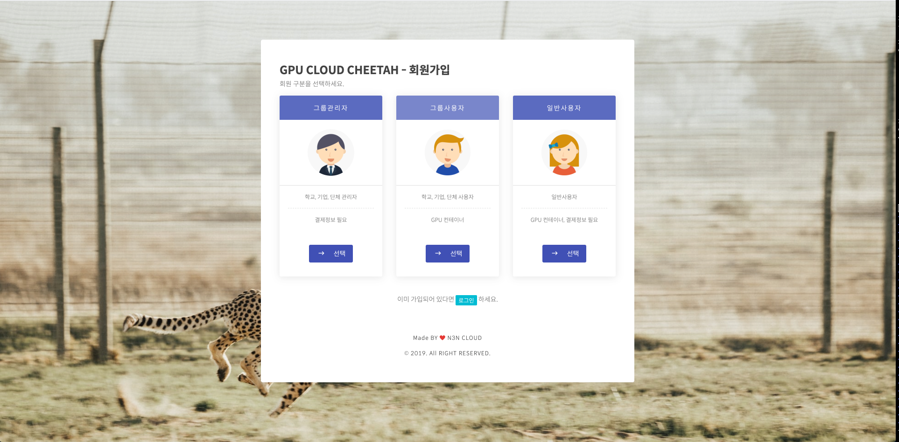
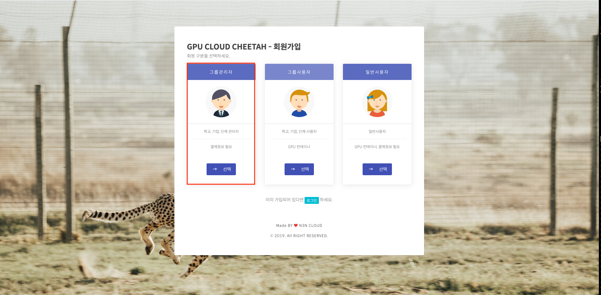
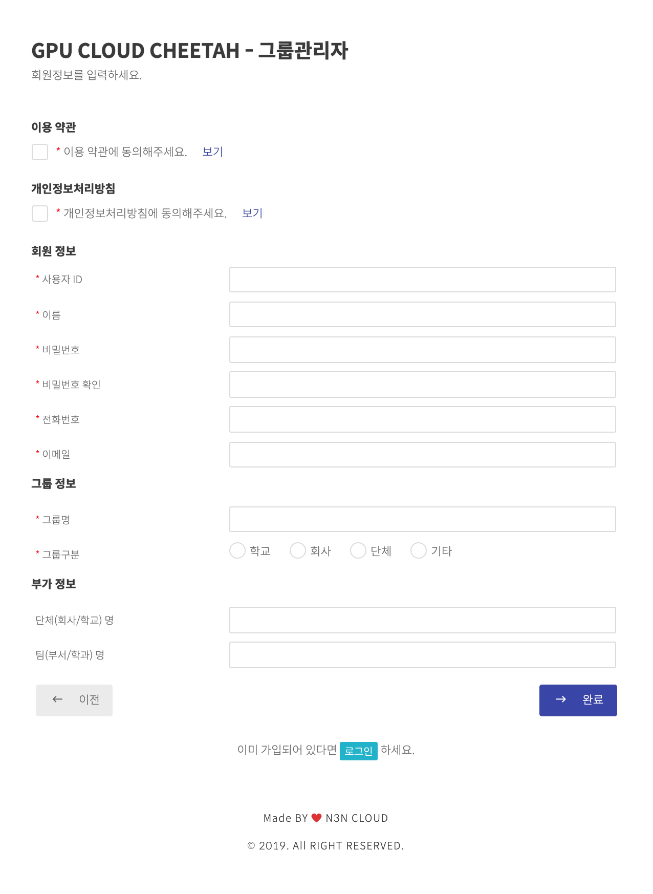
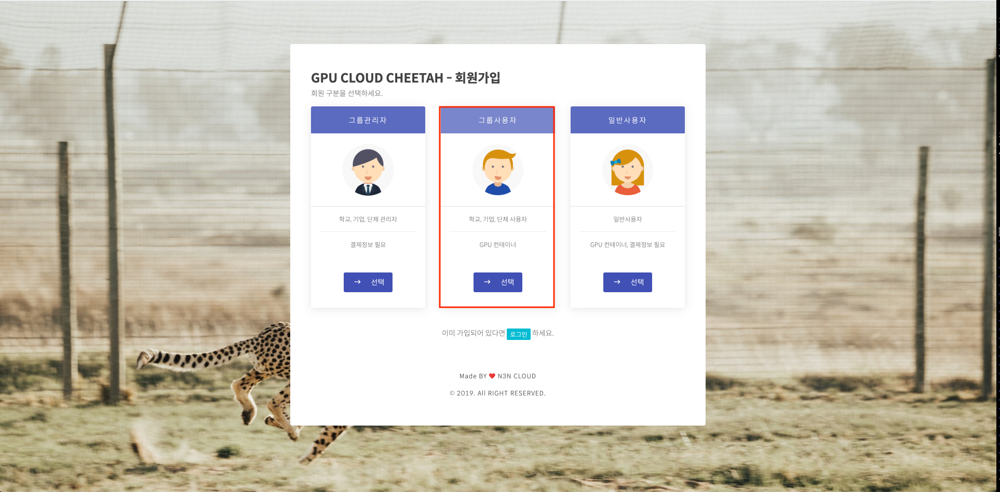
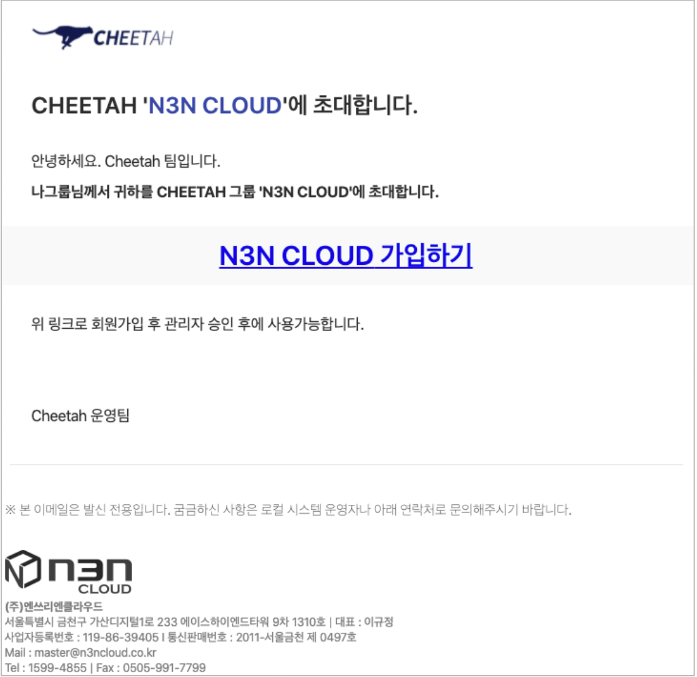
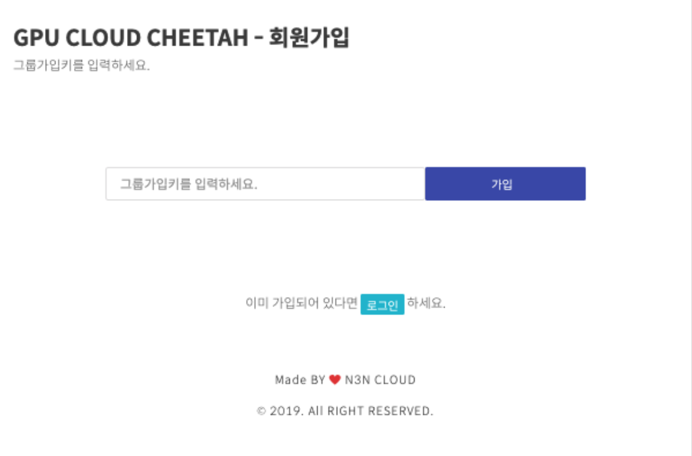
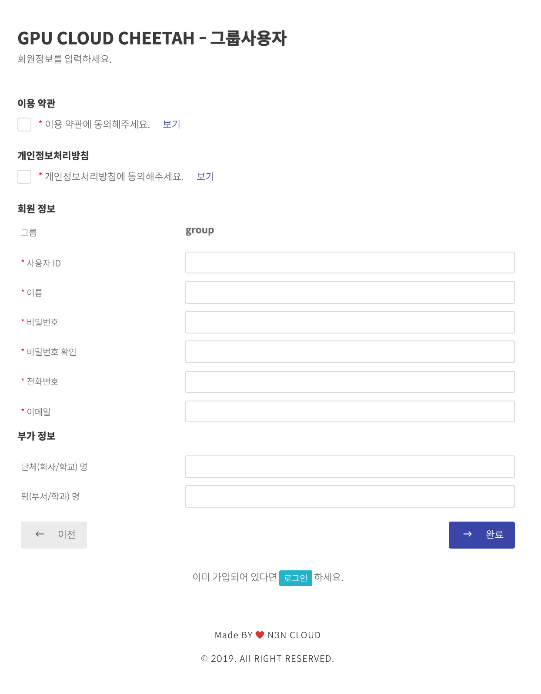
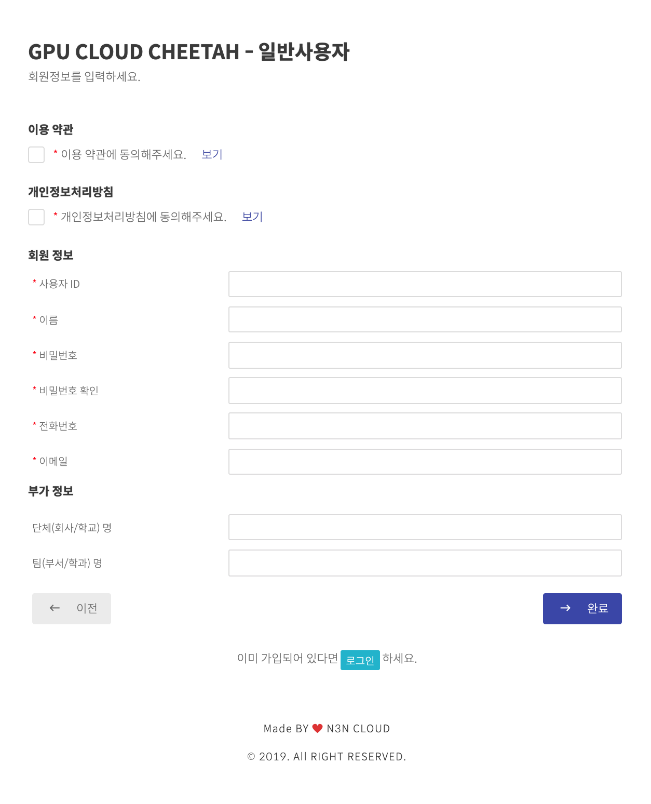

Cheetah 회원가입
-------------------

### 1.1. 사용자 로그인

 신규가입자는 아래의 “회원가입”를 통하여 가입이 가능합니다. 기존에 가입하신 고객 중 비밀번호를 분실하신 분들은 아래의 “비밀번호 찾기”를 통해 확인이 가능합니다.


### 1.2. 회원가입종류
사용자의 환경에는 크게 그룹과 일반 두가지 그룹으로 나누어 집니다.
  
 - 그룹 관리자는 그룹 사용자의 자원 관리 및 회원가입 승인 등을 허락 할 수 있으며 그룹의 전체 자원 할당을 담당합니다.
 - 그룹 사용자는 그룹 관리자를 통하여 모든 승인이 이루어 집니다.
 - 일반 사용자는 관리자를 통하여 모든 승인이 이루어집니다.

</img>

### 1.3. 그룹 관리자 회원가입
그룹 관리자는 그룹의 모든 소스를 제어, 관리 가능한 권한이 있는 계정입니다.
관리자 계정을 통하여 그룹 사용자들을 초대가 가능하며 그룹의 모든 자원은 그룹 관리자를 통하여 종합적으로 관리합니다.

</img>

#### 1.3.1. 그룹 관리자 정보입력
```
그룹 회원 정보
- 사용자 ID : 사용자 ID는 사용자를 식별하는 고유 ID로써 숫자,영문 소문자 4자 이상을 입력해야 합니다.
- 사용자 이름 : 화면에 노출되는 그룹 관리자의 이름입니다.
- 비밀번호 : 로그인 및 사용자 개인의 보안을 위해 사용되는 암호입니다. 숫자, 영문 소문자 6자 이상을 입력해야 합니다.
- 전화번호 : 그룹의 대표 연락처를 입력합니다.
- 이메일 : 그룹의 이메일을 입력합니다, 해당 이메일을 통하여 접속 정보 및 업데이트 사항 및 각종 전달사항이 전달됩니다.

그룹 정보
- 그룹명 : 화면에 노출되는 그룹의 이름입니다.
- 그룹구분 : 학교, 회사, 단체, 기타 크게 4가지로 구분하였습니다
```

위 정보들을 입력 후 시스템 관리자에게 승인을 요청합니다. 시스템 관리자가 승인을 완료하면 가입이 완료됩니다.

</img>

### 1.4. 그룹 사용자 회원가입
그룹 사용자는 컨테이너 신청 및 사용이 가능하며 결제시스템은 관리자 계정을 통하여 종합으로 관리됩니다.

</img>

#### 1.4.1. 그룹사용자 회원가입 방법

그룹 사용자는 2가지 방법으로 회원가입을 할 수 있습니다.

  - 이메일 초대를 이용하는 방법

<p align="center"></img></p>

<center>이메일이 도착하지 않을 경우 스팸메일함 확인해 주시길 바랍니다</center> <br/>

  - 그룹가입키를 통한 회원가입

  그룹 관리자에게 제공받은 그룹가입키를 입력합니다.

<p align="center"></img></p>

#### 1.4.2. 그룹 사용자  정보압력

```
회원정보
- 그룹 : 그룹 관리자가 등록한 그룹명이 나타나며 정이 불가능합니다.
- 사용자 ID : 사용자 ID는 사용자를 식별하는 고유 ID로써 숫자,영문 소문자 4자 이상을 입력해야 합니다.
- 사용자 이름 : 화면에 노출되는 사용자의 이름입니다.
- 비밀번호 : 로그인 및 사용자 개인의 보안을 위해 사용되는 암호입니다. 숫자, 영문 소문자 6자 이상을 입력해야 합니다.
- 전화번호 : 사용자 연락처를 입력합니다.
- 이메일 : 사용자의 이메일을 입력합니다, 해당 이메일을 통하여 접속 정보 및 업데이트 사항 및 각종 전달사항이 전달됩니다.
```

위 정보들을 입력 후, 완료버튼을 눌러 그룹관리자가 승인하면 가입완료됩니다.

</img>

### 1.5. 일반 사용자 회원가입
일반 사용자는 컨테이너 신청 및 사용이 가능하며 시스템계정을 통하여 종합으로 관리됩니다.

</img>

#### 1.5.1. 일반사용자  정보압력

```
회원정보
- 사용자 ID : 사용자 ID는 사용자를 식별하는 고유 ID로써 숫자,영문 소문자 4자 이상을 입력해야 합니다.
- 사용자 이름 : 화면에 노출되는 사용자의 이름입니다.
- 비밀번호 : 로그인 및 사용자 개인의 보안을 위해 사용되는 암호입니다. 숫자, 영문 소문자 6자 이상을 입력해야 합니다.
- 전화번호 : 사용자 연락처를 입력합니다.
- 이메일 : 사용자의 이메일을 입력합니다, 해당 이메일을 통하여 접속 정보 및 업데이트 사항 및 각종 전달사항이 전달됩니다.
```

</img>
